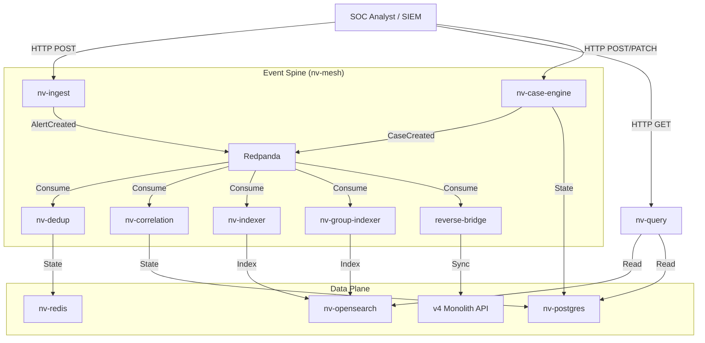

# NeuralVyuha Architecture Overview

## 1. System Overview
NeuralVyuha is designed as a **data-centric microservices architecture** that decouples high-volume ingestion from complex state management. The system is built around a central event spine (Redpanda/Kafka) and specialized read/write models.

### 1.1 Core Principles
*   **Decoupled Services**: Each service has a specific responsibility (e.g., ingest, dedup, correlation) and communicates asynchronously via events.
*   **Event Sourcing**: The system uses Redpanda as the single source of truth for events. All state changes (Case Created, Alert Updated) are emitted as events.
*   **CQRS (Command Query Responsibility Segregation)**:
    *   **Write Model**: Optimized for high write throughput (Redis/Postgres).
    *   **Read Model**: Optimized for fast querying and analytics (OpenSearch/Postgres).
*   **Fail-Open Design**: Components can degrade gracefully. If the Correlation Engine is down, Ingestion continues. If the Search Index is rebuilding, the Write API remains active.

## 2. High-Level Diagram

## 3. Service Details

### 3.1 Ingestion Layer (nv-ingest)
*   **Responsibility**: Validates and normalizes incoming alerts.
*   **Technology**: Python FastAPI (Stateless).
*   **Output**: Produces `AlertCreated` events to Kafka.

### 3.2 Deduplication & Correlation (nv-dedup, nv-correlation)
*   **Responsibility**: Reduces noise (fingerprinting) and groups related alerts into Incidents (Vyuha).
*   **Technology**: Python, Redis (for dedup state), Postgres (for correlation rules).

### 3.3 Case Management (nv-case-engine)
*   **Responsibility**: The authoritative "Master of Record" for Cases, Tasks, and Observables.
*   **Technology**: Python FastAPI, Postgres.
*   **Features**: Implements Idempotency, Versioning, and Audit Logging.

### 3.4 Query & Search (nv-query, nv-indexer)
*   **Responsibility**: Provides a unified read API for the UI.
*   **Technology**: Python, OpenSearch.
*   **Features**: Supports complex filtering, aggregations, and full-text search.

### 3.5 Legacy Bridge (reverse-bridge)
*   **Responsibility**: Ensures backward compatibility by syncing v5 events to the legacy v4 API.
*   **Technology**: Python Worker.

## 4. Security
*   **Authentication**: JWT-based (OIDC compatible).
*   **Authorization**: RBAC enforced at the API Gateway level (or service level middleware).
*   **Tenant Isolation**: Strict logical separation of data by `tenant_id` in all data stores.
