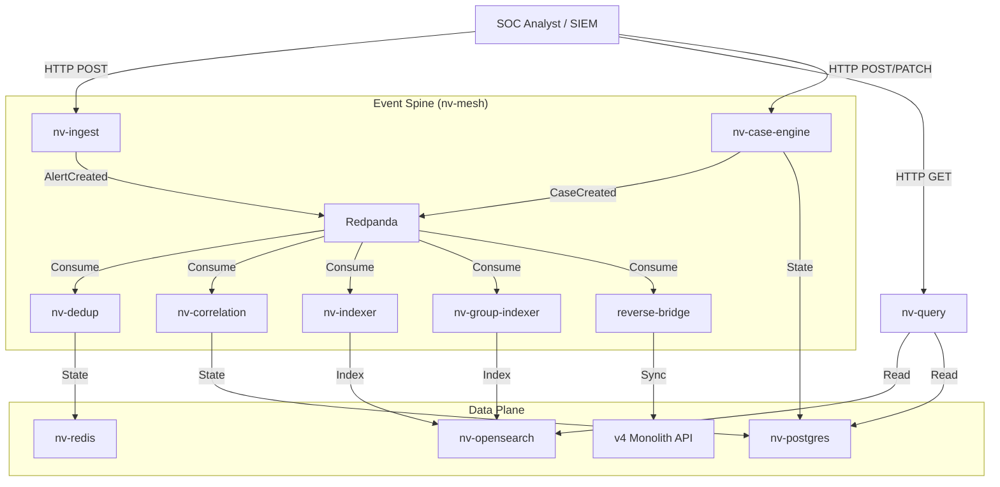

# NeuralVyuha User Manual

## 1. Introduction
NeuralVyuha is the next-gen SOC engine. This manual covers all aspects of daily operations.

# NeuralVyuha Installation Guide

## 1. Introduction
NeuralVyuha is a high-performance Security Incident Response Platform (SIRP) engine designed for modern Security Operations Centers (SOCs). This guide walks you through setting up the complete NeuralVyuha stack using Docker Compose.

## 2. Prerequisites
*   **Operating System**: Linux (Ubuntu 20.04+ recommended) or macOS.
*   **Docker Engine**: Version 20.10.0 or higher.
*   **Docker Compose**: Version 1.29.2 or higher.
*   **Hardware**: Minimum 8GB RAM, 4 vCPUs (for the full stack including OpenSearch and Redpanda).

## 3. Quick Start (Development/Testing)

### Step 3.1: Clone the Repository
```bash
git clone https://github.com/thehive-project/thehive-v5.git neural-vyuha
cd neural-vyuha
```

### Step 3.2: Configure Environment
The default configuration is set for a local development environment. For production, you **must** update the secrets.

1.  Navigate to the event spine directory:
    ```bash
    cd nv-core/event-spine
    ```
2.  (Optional) Create a `.env` file if you need to override defaults:
    ```bash
    touch .env
    # Add overrides like:
    # POSTGRES_PASSWORD=mysecretdbpass
    # JWT_SECRET=myproductionjwtsecret
    ```

### Step 3.3: Launch the Stack
```bash
docker-compose up -d
```

This command starts the following services:
*   **nv-redpanda**: High-performance streaming platform (Kafka API compatible).
*   **nv-redis**: Fast in-memory cache for deduplication.
*   **nv-postgres**: Relational database for Case Management (The Vault).
*   **nv-opensearch**: Search and analytics engine.
*   **nv-ingest**: Alert Ingestion Service.
*   **nv-dedup**: Deduplication & Correlation Service.
*   **nv-case-engine**: The Master of Record for Cases & Tasks.
*   **nv-query**: Unified Read API.
*   **nv-indexer**: Indexes data into OpenSearch.
*   **nv-correlation**: Real-time incident clustering engine.
*   **nv-group-indexer**: Indexes correlation groups.
*   **reverse-bridge**: Synchronizes v5 data back to legacy v4 API (optional).

### Step 3.4: Verify Installation
Check the status of all containers:
```bash
docker-compose ps
```
All containers should be in `Up (healthy)` state.

You can verify the API is reachable:
```bash
curl http://localhost:8001/healthz  # Query API
curl http://localhost:8002/healthz  # Case Engine
```

## 4. Post-Installation
*   **Access the UI**: (Assuming legacy UI integration) Navigate to `http://localhost:9000` (or your configured UI port).
*   **Default Credentials**:
    *   **User**: `admin@thehive.local` (or as configured in your initial setup script).
    *   **Password**: `secret` (Change immediately on first login!).

## 5. Troubleshooting
*   **"Kafka Connection Failed"**: Ensure `nv-redpanda` is healthy. Check logs: `docker-compose logs nv-redpanda`.
*   **"Database Connection Refused"**: Ensure `nv-postgres` is ready. It might take a few seconds to initialize on first run.
*   **"Permission Denied"**: If using bind mounts, ensure the user running docker has permission to write to the `data/` directories.

## 6. Upgrading
To upgrade to a newer version of NeuralVyuha:
1.  Pull the latest code: `git pull origin main`.
2.  Rebuild images: `docker-compose build`.
3.  Restart services: `docker-compose up -d`.


# NeuralVyuha Architecture Overview

## 1. System Overview
NeuralVyuha is designed as a **data-centric microservices architecture** that decouples high-volume ingestion from complex state management. The system is built around a central event spine (Redpanda/Kafka) and specialized read/write models.

### 1.1 Core Principles
*   **Decoupled Services**: Each service has a specific responsibility (e.g., ingest, dedup, correlation) and communicates asynchronously via events.
*   **Event Sourcing**: The system uses Redpanda as the single source of truth for events. All state changes (Case Created, Alert Updated) are emitted as events.
*   **CQRS (Command Query Responsibility Segregation)**:
    *   **Write Model**: Optimized for high write throughput (Redis/Postgres).
    *   **Read Model**: Optimized for fast querying and analytics (OpenSearch/Postgres).
*   **Fail-Open Design**: Components can degrade gracefully. If the Correlation Engine is down, Ingestion continues. If the Search Index is rebuilding, the Write API remains active.

## 2. High-Level Diagram


## 3. Service Details

### 3.1 Ingestion Layer (nv-ingest)
*   **Responsibility**: Validates and normalizes incoming alerts.
*   **Technology**: Python FastAPI (Stateless).
*   **Output**: Produces `AlertCreated` events to Kafka.

### 3.2 Deduplication & Correlation (nv-dedup, nv-correlation)
*   **Responsibility**: Reduces noise (fingerprinting) and groups related alerts into Incidents (Vyuha).
*   **Technology**: Python, Redis (for dedup state), Postgres (for correlation rules).

### 3.3 Case Management (nv-case-engine)
*   **Responsibility**: The authoritative "Master of Record" for Cases, Tasks, and Observables.
*   **Technology**: Python FastAPI, Postgres.
*   **Features**: Implements Idempotency, Versioning, and Audit Logging.

### 3.4 Query & Search (nv-query, nv-indexer)
*   **Responsibility**: Provides a unified read API for the UI.
*   **Technology**: Python, OpenSearch.
*   **Features**: Supports complex filtering, aggregations, and full-text search.

### 3.5 Legacy Bridge (reverse-bridge)
*   **Responsibility**: Ensures backward compatibility by syncing v5 events to the legacy v4 API.
*   **Technology**: Python Worker.

## 4. Security
*   **Authentication**: JWT-based (OIDC compatible).
*   **Authorization**: RBAC enforced at the API Gateway level (or service level middleware).
*   **Tenant Isolation**: Strict logical separation of data by `tenant_id` in all data stores.


# NeuralVyuha API Reference

## Base URL
All endpoints are relative to the service base URL (e.g., `http://localhost:8000` for Ingest, `http://localhost:8001` for Query).

## Authentication
All API requests require a valid JWT in the `Authorization` header:
`Authorization: Bearer <token>`

## 1. Alert Ingestion (nv-ingest)

### POST /alerts
Ingest a new alert.
*   **Request Body**: JSON (Schema validated).
*   **Headers**: `Idempotency-Key` (Required).
*   **Response**: `201 Created` with `{ "id": "uuid", "status": "accepted" }`.

## 2. Query API (nv-query)

### GET /alerts
Search for alerts.
*   **Parameters**:
    *   `q`: Search query string (Lucene syntax).
    *   `limit`: Max results (default 10).
    *   `sort`: Sort field (e.g., `-timestamp`).
*   **Response**: JSON array of alerts.

### GET /groups (Incidents)
List correlation groups (Vyuha).
*   **Parameters**:
    *   `status`: Filter by status (OPEN, CLOSED).
    *   `severity`: Filter by severity (1-4).
*   **Response**: JSON array of groups with metadata.

### GET /cases
List cases from the Master of Record.
*   **Parameters**: standard pagination/filtering.
*   **Response**: JSON array of cases.

## 3. Case Management (nv-case-engine)

### POST /cases
Create a new case.
*   **Request Body**: `{ "title": "string", "description": "string", "severity": 2, ... }`
*   **Headers**: `Idempotency-Key` (Required).
*   **Response**: `201 Created` with Case ID.

### PATCH /cases/{id}
Update a case.
*   **Request Body**: JSON patch.
*   **Response**: `200 OK` with updated version number.

### POST /cases/{id}/tasks
Add a task to a case.
*   **Request Body**: `{ "title": "string", ... }`
*   **Response**: `201 Created` with Task ID.

### POST /tasks/{id}/logs
Add a log/note to a task.
*   **Request Body**: `{ "message": "string", ... }`
*   **Response**: `201 Created` with Log ID.

## 4. Health & Metrics

### GET /healthz
Liveness probe. Returns `200 OK`.

### GET /readyz
Readiness probe. Checks dependencies (DB, Kafka).

### GET /metrics
Prometheus metrics endpoint.


## 5. Architectural Decisions (ADRs)
### ADR-035-GLOBAL-NAMESPACE-MIGRATION.md
# ADR-035: Global Namespace Migration to NeuralVyuha

## Status
Accepted

## Context
The "TheHive NeuralVyuha" project is undergoing a strategic rebranding to "NeuralVyuha". This requires a comprehensive renaming of all technical artifacts, including directory structures, service names, container definitions, network identifiers, and data plane resources (Kafka topics, OpenSearch indices).

The goal is to eliminate all references to "v5", "TheHive", and "cortex" from the internal engine codebase (`neural-vyuha-engine`) to establishing a distinct identity and namespace that does not conflict with legacy v4 systems.

## Decision
We will execute a global namespace migration with the following specifications:

1.  **Directory Structure**:
    *   Rename `neural-vyuha-engine/` to `nv-core/`.
    *   Rename all service subdirectories to match the new `nv-` naming convention.

2.  **Service & Container Naming**:
    *   All Docker containers and services will use the `nv-` prefix.
    *   `nv-ingest` -> `nv-ingest`
    *   `nv-case-engine` -> `nv-case-engine`
    *   `nv-query` -> `nv-query`
    *   `nv-indexer` -> `nv-indexer`
    *   `nv-correlation` -> `nv-correlation`
    *   `nv-dedup` -> `nv-dedup`
    *   `nv-group-indexer` -> `nv-group-indexer`

3.  **Infrastructure**:
    *   Docker Network: `nv-mesh` (replacing `nv-mesh`).
    *   Postgres Database: `nv_vault` (replacing `nv_vault`).

4.  **Data Plane**:
    *   Kafka Topics: All topics must start with `nv.` (e.g., `nv.alerts.ingest`).
    *   OpenSearch Indices: All indices must start with `nv-` (e.g., `nv-alerts-v1-2023.10`).

5.  **Identity & Security**:
    *   JWT Audience: `neural-vyuha-engine`.
    *   Event Envelopes: `NeuralDLQEvent`.

## Consequences
*   **Isolation**: The new namespace ensures complete isolation from v4-LTS components.
*   **Clarity**: The "NeuralVyuha" brand is now reflected in the technical architecture.
*   **Breaking Changes**: Requires fresh deployment.
*   **CI/CD**: `v5-ci.yml` renamed to `nv-ci.yml`.


### ADR-036-NEURALVYUHA-UI-STANDARDS.md
# ADR-036: NeuralVyuha UI Component Standards

## Status
Accepted

## Context
With Phase E6.2, we are introducing new UI components ("NeuralVyuha Incidents") into the legacy AngularJS shell. These components interface directly with the new `nv-core` backend services via the `nv-query` API, bypassing the legacy monolith's data access layer.

## Decision
We define the following standards for all NeuralVyuha UI development:

1.  **Namespace Isolation**: All new Angular components (Controllers, Services, Directives) must be prefixed with `Nv` (e.g., `NvGroupListCtrl`, `NvApiSrv`).
2.  **API Access**:
    *   All HTTP calls to `nv-core` services must be routed through `NvApiSrv`.
    *   Use `NvConfig` for base URL configuration.
    *   Auth Token: Attempts to inject JWT from `AuthenticationSrv.currentUser.token` if available, otherwise relies on session cookies via proxy.
3.  **Error Handling**:
    *   "Fail Open": UI components should handle API unavailability gracefully (e.g., loading states, empty lists) without crashing the entire application.
    *   Use `NotificationSrv` for user feedback on 403 (Permission Denied) errors.
4.  **Routing**:
    *   New routes must be prefixed with `/nv/` (e.g., `/nv/incidents`).
    *   Use `ui-sref="app.nv-..."` for internal navigation.

## Consequences
*   **Decoupling**: UI components are loosely coupled to the backend implementation, allowing independent evolution of the `nv-core` API.
*   **Consistency**: A unified service (`NvApiSrv`) ensures consistent error handling and auth token management.
*   **Maintainability**: Clear separation of legacy code and new NeuralVyuha code via naming conventions.


### ADR-037-CASE-DATA-FALLBACK.md
# ADR-037: Case Data Fallback & Consistency Policy

## Status
Accepted

## Context
Phase E6.3 migrates the Case and Task "Read-Path" to the NeuralVyuha (NV) backend. However, the NV backend is strictly decoupled from the v4 monolith and relies on the Phase B1 Sync Service to stay up-to-date. There is a risk of:
1.  **Latency:** NV might be slightly behind v4 due to async replication.
2.  **Incompleteness:** NV Case Service might not yet support all legacy fields (e.g., computed statistics like `taskStats`, `observableStats`).
3.  **Availability:** NV services are new and might be less stable than the LTS monolith.

## Decision
We implement a **"Fail-Safe Strangler Pattern"** for Case reads in the UI:

1.  **Primary Path:** The UI (`CaseSrv`) attempts to fetch data from the NV API (`NvApiSrv`) first.
2.  **Fallback Path:** If the NV API returns a 404 (Not Found) or 5xx (Error), the UI automatically falls back to the legacy v4 API (`QuerySrv`) without interrupting the user flow.
3.  **Data Mapping:** NV response objects are mapped to the legacy Schema on the client-side to ensure compatibility with existing AngularJS templates.
4.  **Transparency:** Cases served by the NV engine are marked with an "NV" badge in the UI. Cases served by v4 (fallback) have no badge.

## Consequences
*   **Reliability:** User experience is protected against NV instability.
*   **Visibility:** Analysts can see which engine is serving their data, aiding in trust-building and debugging.
*   **Stats Limitation:** If NV data is used, some computed stats (e.g., attachment counts) might be missing or zero until the NV backend implements deep aggregation. This is an accepted trade-off for E6.3 to validate the core read path.

## Governance
Any data drift detected (where NV returns stale data compared to v4) should be logged as a warning in the browser console for debugging but will not block the user.


### ADR-038-DUAL-WRITE-REVERSE-SYNC.md
# ADR-038: Dual-Write & Reverse Sync Strategy

## Status
Accepted

## Context
Phase E6.4 marks the transition of the "Write Path" for Cases and Tasks from the legacy v4 monolith to the NeuralVyuha (NV) engine. To ensure zero downtime and maintain legacy system integrity during the cutover, we need a strategy that keeps v4 in sync with v5 without coupling the UI write performance to the legacy backend.

## Decision
We implement an **Asynchronous Reverse Sync** pattern:

1.  **Master of Record**: NeuralVyuha (NV) is now the authoritative source for new Cases and Tasks.
2.  **UI Writes**: The frontend writes directly to NV via `NvApiSrv`.
3.  **Reverse Bridge**: A dedicated worker service consumes NV domain events (e.g., `nv.cases.created.v1`) and replicates them to the legacy v4 API.
4.  **Panic Switch**: A configuration flag `NvConfig.MASTER_WRITE_TARGET` allows instant rollback to v4 writes if NV experiences critical failure.

## Consequences
*   **Performance**: UI interactions are decoupled from legacy system latency.
*   **Consistency**: There is a small replication lag (usually sub-second). The UI handles this by reading from NV immediately.
*   **Conflict Resolution**: If a case exists in v4 (e.g., created manually during migration), the Reverse Bridge attempts to link or update it, prioritizing NV state.
*   **Idempotency**: All writes must use `Idempotency-Key` to prevent duplication during network retries or replay.

## Governance
*   The legacy v4 database must contain a `v5_ref` custom field to store the NV Case UUID.
*   Updates from v4 to v5 (if any occur) must be handled by the existing Phase B1 Sync Service (bidirectional sync is now active but v5 is primary).


### ADR-039-DOCS-AS-CODE.md
# ADR-039: Documentation-as-Code & UI Help Injection Strategy

## Status
Accepted

## Context
As NeuralVyuha (NV) transitions to production, maintaining separate documentation repositories and UI help files creates synchronization issues. The "Help Center" in the UI must reflect the latest architectural decisions and API specifications without manual copy-pasting.

## Decision
We adopt a **"Docs-as-Code"** strategy with the following components:

1.  **Single Source of Truth**: GitHub Markdown files in `docs/` are the authoritative source.
    *   `INSTALLATION.md`: Setup guide.
    *   `ARCHITECTURE.md`: High-level design.
    *   `API_REFERENCE.md`: Endpoint specifications.
    *   `USER_MANUAL.md`: Aggregated manual for end-users.

2.  **Aggregation Pipeline**:
    *   A Python script (`tools/generate_manual.py`) merges individual topic files into a comprehensive `USER_MANUAL.md`.
    *   This script runs during CI/CD to ensure the manual is always up-to-date with code changes.

3.  **UI Injection**:
    *   The NeuralVyuha UI consumes documentation via a dedicated `NvHelpCtrl`.
    *   For Phase D1, the UI displays a curated "Quick Help" (Introduction, Triage, Timeline) and links to the full generated manual.
    *   Future phases will fetch the manual content dynamically via API (GET /docs).

## Consequences
*   **Consistency**: UI help and GitHub docs are synchronized.
*   **Maintainability**: Developers update docs alongside code (in the same PR).
*   **Accessibility**: SOC analysts access help directly within their workflow.
*   **Automation**: Manual generation is automated, reducing human error.

## Governance
*   All new features (Phase E7+) must include an update to the relevant markdown file in `docs/`.
*   The `generate_manual.py` script must pass in CI before merging.
