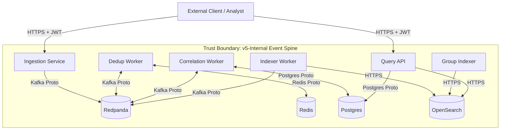

# Engine Threat Model

**Status**: Baseline (Phase E1)
**Last Updated**: 2026-02-11

## 1. System Assets & Trust Boundaries

### Assets
- **Alert Data**: Sensitive security events (Confidentiality/Integrity).
- **Correlation Rules**: Detection logic (Integrity).
- **Authentication Tokens**: JWTs providing access (Confidentiality).
- **Audit Logs**: Forensics trail (Integrity/Availability).
- **Infrastructure**: Compute/Storage resources (Availability).

### Trust Boundaries

## 2. Attack Surface Analysis

| Component | Port | Protocol | Exposure | Auth |
|-----------|------|----------|----------|------|
| Ingestion Service | 8000 | HTTP | Public/Internal | JWT (Bearer) |
| Query Service | 8001 | HTTP | Public/Internal | JWT (Bearer) |
| Redpanda | 9092 | TCP (Kafka) | Internal Only | None (Phase E1) |
| Redis | 6379 | TCP | Internal Only | None (Phase E1) |
| Postgres | 5432 | TCP | Internal Only | User/Pass |
| OpenSearch | 9200 | HTTP | Internal Only | None (Phase E1) |

## 3. STRIDE Analysis

### Spoofing (Identity)
- **Threat**: Attacker forges JWT to impersonate Tenant A.
- **Mitigation**: RS256 signature validation with JWKS. Strict `iss` and `aud` checks.
- **Threat**: Attacker spoofs `tenant_id` in request body.
- **Mitigation**: Ingestion Service ignores body `tenant_id`. Forces use of JWT claim.
- **Gap**: Internal service-to-service calls (e.g. if an attacker compromises a container) have no mTLS/AuthZ yet (Risk R-017).

### Tampering (Integrity)
- **Threat**: Attacker modifies alerts in transit (Kafka).
- **Mitigation**: None currently (Internal Network). E2: TLS Encryption.
- **Threat**: Attacker modifies correlation rules to hide attacks.
- **Mitigation**: RBAC (`rules.write` permission required). Audit logs generated for rule changes.

### Repudiation (Logging)
- **Threat**: Malicious admin deletes logs.
- **Mitigation**: Logs shipped to stdout (container). No centralized immutable storage yet (Gap).
- **Threat**: Correlation engine makes decision without record.
- **Mitigation**: `correlation.audit.v1` events emitted for every link action.

### Information Disclosure (Privacy)
- **Threat**: Tenant B queries Tenant A's alerts.
- **Mitigation**: Query API appends `filter: { term: { tenant_id: ... } }` to ALL searches. Validates returned docs match tenant.
- **Threat**: Secrets (DB password) leaked via env vars.
- **Mitigation**: None (Gap). E5: Vault.

### Denial of Service (Availability)
- **Threat**: Flood of alerts crashes ingestion.
- **Mitigation**: Redpanda buffering. Async FastAPI.
- **Gap**: No rate limiting implemented yet (Risk R-009).
- **Threat**: Poison message crashes consumers loop.
- **Mitigation**: DLQ Logic + Batch Success tracking (commit only on success).

### Elevation of Privilege (Authorization)
- **Threat**: `DEV_MODE` header injection in production.
- **Mitigation**: `middleware.py` ignores headers unless `DEV_MODE=true` AND `ALLOW_DEV_OVERRIDES=true`.
- **Threat**: User elevates role to `SYSTEM_ADMIN`.
- **Mitigation**: JWT roles are signed by IdP. API validates role presence.

## 4. Mitigation Mapping

| Threat | Implemented Control | Status |
|--------|---------------------|--------|
| Cross-Tenant Access | JWT Extraction + DB/Search Filters | Verified |
| Replay Attacks | Idempotent `_id` + DB Constraints | Verified |
| Data Loss (Crash) | AOF + Manual Commits | Verified |
| Insecure Defaults | RS256 Startup Guardrail | Verified |
| Rule Abuse | Read-Only Simulation API | Verified |
| Internal Sniffing | None (Flat Network) | Open (E2) |
| Secret Leakage | None (Env Vars) | Open (E5) |
| Privilege Escalation | Granular RBAC (Permissions) | Verified (E2) |
| Case Tampering | RBAC (case:write) + Tenant Isolation | Verified (E3) |
| DLQ Poisoning / Outage | No-Commit on DLQ Failure (Fail-Safe) | Verified (E4.1) |
| DoS (Replay Storm) | Backpressure + Bounded Poll | Verified (E4.2) |
| Metrics Data Leakage | Internal Binding (Workers) + No sensitive labels | Verified (E4.3) |
| Secret Exposure | Redacted Logs + Secure Loader | Verified (E5) |
| API DoS | Rate Limiting (Tenant Isolated) | Verified (E5) |
