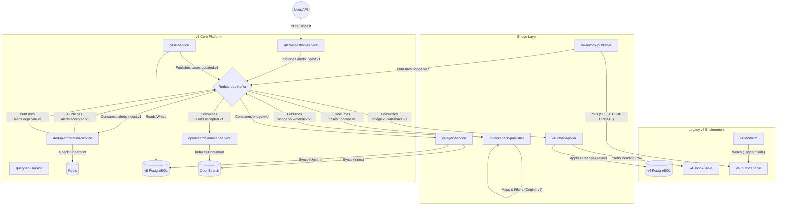

# TheHive v5 Architecture & Workflow

This document details the architectural workflow of TheHive v5, including its ingestion pipeline, the synchronization bridge with the legacy v4 system, and the writeback mechanism.

> **Feature Comparison**: For a detailed mapping of features, data models, and API endpoints between v4 and v5, please refer to [V4_V5_FEATURE_MAPPING.md](./V4_V5_FEATURE_MAPPING.md).

## High-Level Architecture (Mermaid)

## Detailed Workflow Description

### 1. v5 Alert Ingestion Pipeline
The v5 ingestion pipeline is designed for high throughput and reliability.

1.  **Ingestion (`alert-ingestion-service`)**:
    *   Receives HTTP `POST /ingest` requests.
    *   Validates authentication and schema.
    *   Publishes the raw alert to the Kafka topic `alerts.ingest.v1`.
    *   Returns an Accepted (202) response with an `event_id`.

2.  **Deduplication (`dedup-correlation-service`)**:
    *   Consumes events from `alerts.ingest.v1`.
    *   Calculates a fingerprint (SHA256) based on source, type, and reference.
    *   Checks **Redis** for this fingerprint within a configured window (e.g., 10 minutes).
    *   **If Duplicate**: Publishes to `alerts.duplicate.v1` (rejected).
    *   **If New**: Sets the key in Redis and publishes to `alerts.accepted.v1` (accepted).

3.  **Indexing (`opensearch-indexer-service`)**:
    *   Consumes accepted alerts from `alerts.accepted.v1`.
    *   Transforms the event payload into an OpenSearch document.
    *   Indexes the document into **OpenSearch** (e.g., `alerts-v1-YYYY.MM`).

### 2. v4 to v5 Synchronization (Bridge)
This flow ensures that data created or updated in the legacy v4 system is replicated to v5.

1.  **Outbox Table (`v4_outbox`)**:
    *   Changes in v4 (Cases, Alerts) are written to the `v4_outbox` table via triggers or application code.

2.  **Publisher (`v4-outbox-publisher`)**:
    *   Polls the `v4_outbox` table using `SELECT ... FOR UPDATE SKIP LOCKED` to claim pending rows.
    *   Publishes corresponding events to Kafka topics (e.g., `bridge.v4.alert`, `bridge.v4.case`).
    *   Updates the outbox row status to `PUBLISHED`.

3.  **Sync Service (`v4-sync-service`)**:
    *   Consumes bridge events (`case.sync.v1`, `alert.sync.v1`).
    *   Performs conflict resolution using timestamps (only updates if v4 timestamp > v5 timestamp).
    *   Updates the v5 data store (OpenSearch/PostgreSQL) to reflect the v4 state.

### 3. v5 to v4 Writeback (Bridge)
This flow allows v5 to act as a source of truth for certain operations, syncing changes back to v4.

1.  **Event Emission**:
    *   v5 Services (e.g., `case-service`) publish domain events (e.g., `cases.updated.v1`) to Kafka.

2.  **Writeback Publisher (`v5-writeback-publisher`)**:
    *   Consumes v5 domain events.
    *   **Loop Prevention**: Checks the `meta.origin` field. If it is 'v4', the event is ignored.
    *   Maps the v5 event schema to the v4 data model.
    *   Publishes a writeback command to `bridge.v5.writeback.v1`.

3.  **Inbox Applier (`v4-inbox-applier`)**:
    *   Consumes writeback commands.
    *   Inserts a row into the `v4_inbox` table (Inbox Pattern) to ensure durability.
    *   An asynchronous loop claims pending inbox rows and applies the changes to the actual v4 tables (e.g., `case_task`, `alert`).
    *   Marks the inbox row as `APPLIED`.
